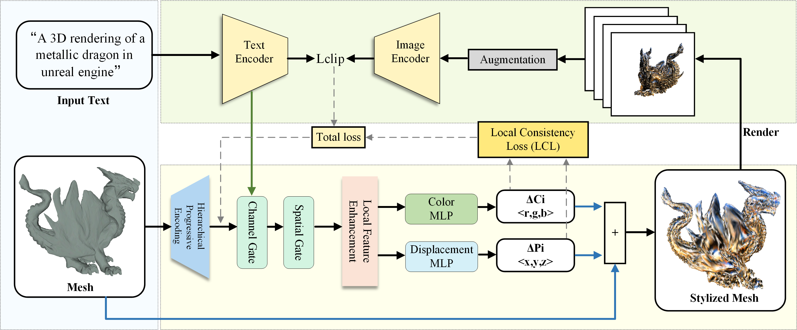

# ETD3D
>A pytorch implementation of "Enhanced Text-Driven 3D Stylization: Local Consistency and Hierarchical Encoding"
>
>
> 📎 *This repository is directly related to the manuscript currently under submission to* **The Visual Computer**.  
> Please cite this paper if you use this code in your research.
##  Overview  

This is a framework for **text-driven 3D mesh stylization**, which enhances **structure robustness**, **stylization fidelity**, and **semantic alignment** in text-guided 3D content generation.

<p align="center">
  
</p>


### System Requirements  

- Python 3.9 
- CUDA 11
- Nvidia GPU with 8 GB ram at least
- the package of clip (https://github.com/openai/CLIP)
- the package of kaolin (https://github.com/NVIDIAGameWorks/kaolin)
  
##  Installation  
Install dependencies via:

```bash
pip install -r requirements.txt
```
## Run examples
>Call the below shell scripts to generate example styles.
```bash
# Cactus vase 
./demo/run_cactus_vase.sh
# Colorful Lamp
./demo/run_colorful_lamp.sh
...
```
## Result
<p align="center">
  
</p>
